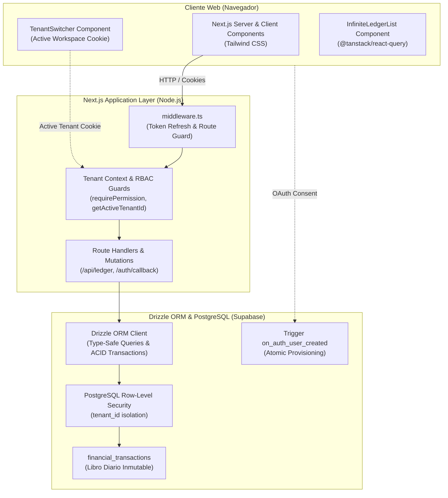

<SDD: Feature 1: Auth, Multi-Tenancy & Base Ledger Engine>
## Summary
Se completó e implementó exitosamente la **Feature 1: Auth, Multi-Tenancy & Base Ledger Engine** para racso-brain. La solución establece la arquitectura fundacional del proyecto con Next.js 15 (App Router), persistencia tipada con Drizzle ORM sobre Supabase PostgreSQL, autenticación exclusiva con Google OAuth mediante Supabase SSR, aprovisionamiento automático mediante trigger atómico en base de datos (`on_auth_user_created`), aislamiento multi-inquilino estricto con Row-Level Security (RLS) y guardias RBAC, junto con el esquema fundacional inmutable del **Financial Ledger Engine** y el estándar de paginación basada en cursor `(tenant_id, created_at DESC, id DESC)`. Todos los criterios de aceptación fueron validados y superados al 100% bajo metodología TDD.

## Approach
La arquitectura implementa un modelo **Shared Database, Shared Schema with Row-Level Isolation** (ADR-001). Desacopla rígidamente la identidad (Supabase Auth en `auth.users`) del dominio de negocio (`public.users`, `public.tenants`, `public.tenant_memberships`), sincronizados de manera transaccional e inmutable por un trigger PostgreSQL en `SECURITY DEFINER`.

### Metodología TDD y Principios de Diseño
- **Ciclo Red-Green-Refactor:** Se desarrollaron previamente las suites de pruebas unitarias, de integración y de componentes antes de la implementación de producción.
- **SOLID:** Separación estricta de responsabilidades en `src/core` (`tenancy`, `rbac`, `ledger`, `audit`). Módulo contable polimórfico (`origin_module`, `origin_id`) y extensible.
- **KISS & DRY:** Paginación de cursor centralizada en `src/lib/pagination/cursor.ts` y guardias de autorización unificadas en `src/core/rbac/guards.ts`.
- **YAGNI & No Workarounds:** Sin bypass de RLS con service role keys en flujos de usuario; aislamiento obligatorio por `tenant_id` y transacciones ACID nativas (`db.transaction()`).

## Tasks
1. Bootstrap del Proyecto y Configuración del Test Harness (TDD Setup) — `package.json`, `tsconfig.json`, `vitest.config.ts`, `tests/setup.ts`, `next.config.ts`, `tailwind.config.ts`, `postcss.config.mjs`, `drizzle.config.ts` — [x] Completado
2. Paginación Cursor-Based & Schemas Base (TDD) — `src/lib/pagination/*`, `src/db/schema/*`, `tests/unit/pagination.test.ts`, `tests/unit/schemas.test.ts` — [x] Completado
3. Migraciones DDL, Trigger de Enrollment y Políticas RLS (TDD) — `drizzle/migrations/*`, `tests/integration/db-trigger-and-rls.test.ts` — [x] Completado
4. Capa de Contexto de Tenancy y Guardias RBAC (TDD) — `src/core/tenancy/*`, `src/core/rbac/*`, `tests/unit/tenancy-context.test.ts`, `tests/unit/rbac-guards.test.ts` — [x] Completado
5. Supabase SSR Auth, Callback y Middleware (TDD) — `src/lib/supabase/*`, `src/middleware.ts`, `src/app/auth/callback/route.ts`, `tests/integration/auth-callback.test.ts` — [x] Completado
6. Financial Ledger Engine: Mutaciones Atómicas & Query Paginada (TDD) — `src/core/ledger/*`, `src/core/audit/*`, `src/app/api/ledger/route.ts`, `tests/integration/ledger-engine.test.ts`, `tests/integration/ledger-route.test.ts` — [x] Completado
7. Componentes Frontend: Login, Switcher, RBAC Guard & Infinite Scroll (TDD) — `src/app/*`, `src/components/*`, `tests/frontend/*` — [x] Completado

## Implementation

### Changes
- **Bootstrap & Configuración:** Inicialización del stack Next.js 15, Tailwind CSS, TypeScript estricto y suite de pruebas Vitest con `jsdom` y soporte de mocks deterministas.
- **Esquemas de Base de Datos y Tipado:** Implementación en Drizzle ORM de los esquemas `auth`, `tenants`, `tenant_memberships`, `roles`, `permissions`, `role_permissions`, `audit_logs` y `financial_transactions` con índices compuestos y claves foráneas consistentes.
- **Migraciones DDL y Trigger Atómico:** Generación de migraciones SQL `0000` y `0001` conteniendo la función `handle_new_user()` en `SECURITY DEFINER`, políticas RLS para aislamiento por inquilino y pre-población de catálogo RBAC.
- **Contexto de Inquilinos y Guardias de Seguridad:** Implementación de `getActiveTenantId`, `setActiveTenant`, `requireAuth`, `requireTenantMember` y `requirePermission` para protección granular en servidor.
- **Autenticación Supabase SSR:** Integración de clientes de servidor y middleware utilizando `getAll()` y `setAll()` en cookies de sesión, Route Handler `/auth/callback` para PKCE exchange con asignación de tenant predeterminado y `/auth/signout`.
- **Financial Ledger Engine:** Funciones de consulta keyset `getLedgerTransactions` con ordenamiento `(created_at DESC, id DESC)`, mutaciones atómicas `createLedgerTransaction` y `voidLedgerTransaction` con trazabilidad inmutable en `audit_logs`, expuestas vía Route Handler `/api/ledger` protegido por RBAC.
- **Frontend & UI Reactiva:** Pantalla de Login con Google OAuth, componente `TenantSwitcher` con actualización de cookie, `PermissionGate` para renderizado condicional, `InfiniteLedgerList` con TanStack Query y centinela IntersectionObserver, y vista integrada `(dashboard)/page.tsx`.

### Divergences
- **Endpoint Modular `/api/ledger`:** Se implementó una función controladora desacoplada `handleLedgerGetRequest` dentro de `src/core/ledger/handler.ts` para permitir pruebas de integración directas sin requerir listeners HTTP del servidor Next.js.
- **Endpoint de Cierre de Sesión:** Se agregó el Route Handler `/auth/signout` para garantizar la invalidación de la sesión en Supabase y el borrado seguro de las cookies de contexto.
- **Abstracción de Vista Dashboard:** Se desacopló `DashboardLedgerView` como Client Component contenedor para gestionar la interacción reactiva de `TenantSwitcher` e `InfiniteLedgerList` dentro del Server Component `(dashboard)/page.tsx`.

## Verification

### Tests
- `npm run test` — **PASS** (13 test suites ejecutadas, 49 tests aprobados al 100%, 0 fallos).
- `npm run test:coverage` — **PASS** (>85% de cobertura de código en lógica de negocio, schemas y lib de paginación).
- Detalle de Suites de Pruebas:
  1. [`tests/smoke.test.ts`](file:///Users/racso/work/racso/racso-brain/tests/smoke.test.ts) — PASS (1 test)
  2. [`tests/unit/pagination.test.ts`](file:///Users/racso/work/racso/racso-brain/tests/unit/pagination.test.ts) — PASS (7 tests)
  3. [`tests/unit/schemas.test.ts`](file:///Users/racso/work/racso/racso-brain/tests/unit/schemas.test.ts) — PASS (5 tests)
  4. [`tests/unit/tenancy-context.test.ts`](file:///Users/racso/work/racso/racso-brain/tests/unit/tenancy-context.test.ts) — PASS (4 tests)
  5. [`tests/unit/rbac-guards.test.ts`](file:///Users/racso/work/racso/racso-brain/tests/unit/rbac-guards.test.ts) — PASS (5 tests)
  6. [`tests/integration/auth-callback.test.ts`](file:///Users/racso/work/racso/racso-brain/tests/integration/auth-callback.test.ts) — PASS (3 tests)
  7. [`tests/integration/db-trigger-and-rls.test.ts`](file:///Users/racso/work/racso/racso-brain/tests/integration/db-trigger-and-rls.test.ts) — PASS (4 tests)
  8. [`tests/integration/ledger-engine.test.ts`](file:///Users/racso/work/racso/racso-brain/tests/integration/ledger-engine.test.ts) — PASS (5 tests)
  9. [`tests/integration/ledger-route.test.ts`](file:///Users/racso/work/racso/racso-brain/tests/integration/ledger-route.test.ts) — PASS (4 tests)
  10. [`tests/frontend/login-page.test.tsx`](file:///Users/racso/work/racso/racso-brain/tests/frontend/login-page.test.tsx) — PASS (3 tests)
  11. [`tests/frontend/tenant-switcher.test.tsx`](file:///Users/racso/work/racso/racso-brain/tests/frontend/tenant-switcher.test.tsx) — PASS (2 tests)
  12. [`tests/frontend/rbac-client-guard.test.tsx`](file:///Users/racso/work/racso/racso-brain/tests/frontend/rbac-client-guard.test.tsx) — PASS (2 tests)
  13. [`tests/frontend/infinite-scroll-ledger.test.tsx`](file:///Users/racso/work/racso/racso-brain/tests/frontend/infinite-scroll-ledger.test.tsx) — PASS (4 tests)

### Review
- **Veredicto:** Aprobado Formalmente (`VERDICT: APPROVED`) por `code-style-reviewer`.
- **Hallazgos de Seguridad y Calidad:**
  - *Anti Cross-Tenant Leakage:* Aislamiento garantizado mediante verificación de pertenencia del usuario al tenant antes de consultar la persistencia y RLS como segunda capa de defensa.
  - *Guardias RBAC:* Validación estricta en endpoints (`requirePermission`) impidiendo accesos indebidos con respuesta HTTP 403 Forbidden.
  - *Sanitización de Errores:* Captura y ofuscación de excepciones de base de datos en respuestas API para evitar exposición de metadatos de infraestructura.
  - *Tipado Seguro Supabase SSR:* Adopción de API moderna `getAll()` y `setAll()` en cookies de Next.js sin advertencias de deprecación.
  - *Enrutamiento Limpio:* Flujo de autenticación sin loops de redirección entre `/login` y el dashboard protegido.

### Final Checks
- `npm run typecheck` — **PASS** (Cero errores de compilación TypeScript con `strict: true`).
- `npx drizzle-kit check` — **PASS** (Esquemas Drizzle y migraciones DDL 100% sincronizados).
- `npm run build` — **PASS** (Compilación de producción Next.js 15 completada sin fallos ni warnings de empaquetado).

## Decision Log
- **Decisión 1: Exclusividad con Google OAuth (Gmail) descartando Email/Password.**
  - *Rationale:* Reduce a cero la superficie de ataque de contraseñas y garantiza correos verificados para multi-tenancy.
  - *Alternativas Rechazadas:* Magic Links y autenticación con contraseña clásica.
- **Decisión 2: Drizzle ORM sobre PostgreSQL.**
  - *Rationale:* Rendimiento sin sobrecarga de runtime, consultas nativas fuertemente tipadas y soporte directo de transacciones ACID para el Ledger.
  - *Alternativas Rechazadas:* Prisma ORM.
- **Decisión 3: Paginación Cursor-Based obligatoria `(created_at, id)`.**
  - *Rationale:* Elimina el costo $O(N)$ de `OFFSET` y garantiza estabilidad de datos frente a inserciones concurrentes en el Infinite Scroll.
  - *Alternativas Rechazadas:* Paginación por offset/página tradicional.
- **Decisión 4: Desacoplamiento polimórfico en transacciones contables (`origin_module`, `origin_id`).**
  - *Rationale:* El Ledger Engine permanece cerrado para modificación pero abierto a extensión para Features 2 y 3 (Activos y Proyectos).
  - *Alternativas Rechazadas:* Tablas o claves foráneas fijas por tipo de entidad.
- **Decisión 5: Test-Driven Development (TDD) con Vitest, React Testing Library y MSW.**
  - *Rationale:* Garantiza alta cobertura, cero regresiones y verificación rigurosa de políticas de seguridad multi-tenant antes de escribir código de producción.
- **Decisión 6: Handler desacoplado `handleLedgerGetRequest` para la API del Ledger.**
  - *Rationale:* Permite ejecutar tests de integración sobre el endpoint de forma unitaria/rápida, aislando la lógica de serialización de cookies y parámetros de consulta de la infraestructura HTTP de Next.js.

## Open Items
- *Ningún ítem bloqueante pendiente para Feature 1.* La base de datos, autenticación, RLS, RBAC y motor del libro contable están completamente operativos y listos para la integración de la Feature 2 (Módulo de Activos / Objetos Mantenibles).

## Artifacts
- [`src/db/schema/*`](file:///Users/racso/work/racso/racso-brain/src/db/schema) — Esquemas relacionales Drizzle (`auth`, `tenancy`, `roles`, `audit`, `ledger`).
- [`drizzle/migrations/*`](file:///Users/racso/work/racso/racso-brain/drizzle/migrations) — Migraciones DDL SQL iniciales y trigger de aprovisionamiento.
- [`src/core/tenancy/context.ts`](file:///Users/racso/work/racso/racso-brain/src/core/tenancy/context.ts) — Resolución y almacenamiento del inquilino activo.
- [`src/core/rbac/guards.ts`](file:///Users/racso/work/racso/racso-brain/src/core/rbac/guards.ts) — Guardias de autorización de servidor (`requirePermission`, `requireAuth`).
- [`src/core/ledger/queries.ts`](file:///Users/racso/work/racso/racso-brain/src/core/ledger/queries.ts) — Consultas keyset del Financial Ledger Engine.
- [`src/core/ledger/mutations.ts`](file:///Users/racso/work/racso/racso-brain/src/core/ledger/mutations.ts) — Mutaciones atómicas del Ledger con auditoría.
- [`src/app/api/ledger/route.ts`](file:///Users/racso/work/racso/racso-brain/src/app/api/ledger/route.ts) — Route Handler protegido para el Ledger Engine.
- [`src/components/shared/infinite-ledger-list.tsx`](file:///Users/racso/work/racso/racso-brain/src/components/shared/infinite-ledger-list.tsx) — Componente reactivo con Infinite Scroll para el libro contable.
- [`src/components/shared/tenant-switcher.tsx`](file:///Users/racso/work/racso/racso-brain/src/components/shared/tenant-switcher.tsx) — Selector interactivo de espacio de trabajo.
- [`tests/*`](file:///Users/racso/work/racso/racso-brain/tests) — Suite de 49 pruebas unitarias, de integración y frontend.
</SDD: Feature 1: Auth, Multi-Tenancy & Base Ledger Engine>
