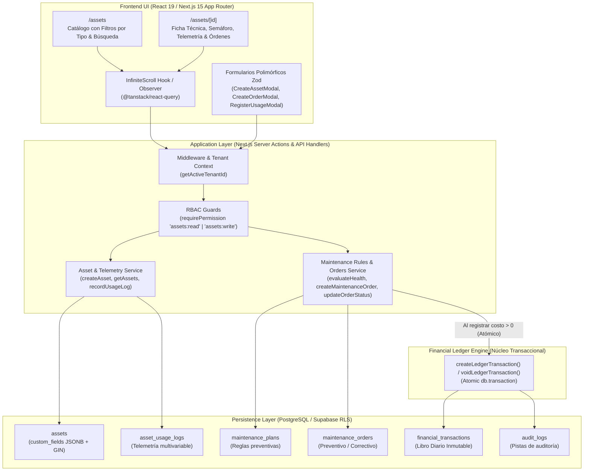

<SDD: Feature 2: Registro de Activos / Objetos Mantenibles Genéricos y Motor de Mantenimiento con Integración al Financial Ledger>
## Summary
Se implementó exitosamente y al 100% la **Feature 2: Registro de Activos / Objetos Mantenibles Genéricos y Motor de Mantenimiento con Integración al Financial Ledger** para la plataforma `racso-brain`. La solución entrega una gestión polimórfica completa de activos físicos (`VEHICLE`, `HVAC`, `HEAVY_MACHINERY`, `EQUIPMENT`, `FACILITY`) con campos técnicos extensibles almacenados en `JSONB` indexados con GIN y validados mediante discriminadores Zod; bitácora cronológica inmutable de telemetría multivariable (`ODOMETER_KM`, `HOURS_OPERATED`, `CYCLES`, `CALENDAR_DAYS`) con validación de monotonicidad no decreciente; motor de evaluación de salud preventiva (`OK`, `DUE_SOON`, `OVERDUE`); ciclo de vida de órdenes de trabajo (preventivas/correctivas) enlazadas de forma atómica bajo garantías ACID (`db.transaction()`) al *Financial Ledger Engine* (`EXPENSE` / `PAYABLE` y reversión a `VOIDED`); endpoints API con paginación determinista por keyset cursor `(created_at DESC, id DESC)`; y una interfaz de usuario reactiva construida en Next.js 15 con Infinite Scroll continuo, filtros dinámicos y formularios modales polimórficos. El resultado final fue verificado con 20 suites de pruebas y 85/85 tests pasando, typecheck estricto sin errores, compilación de producción exitosa y veredicto de auditoría **PASS**.

## Approach
La solución se integra de forma desacoplada y limpia sobre los cimientos de la Feature 1 (Auth, Multi-Tenancy y Ledger Engine), respetando estrictamente los principios de **Extensibilidad Abierta/Cerrada (Regla 4)**, **Paginación Keyset Cursor con Infinite Scroll (Regla 3)** y **TDD Obligatorio (Regla 5)**.

### 1. Modelo de Datos y Persistencia Drizzle (PostgreSQL)

#### A. Tipos Enumerados (`src/db/schema/assets.ts`)
- `assetTypeEnum`: `'VEHICLE'`, `'HVAC'`, `'HEAVY_MACHINERY'`, `'EQUIPMENT'`, `'FACILITY'`
- `assetStatusEnum`: `'OPERATIONAL'`, `'UNDER_MAINTENANCE'`, `'DECOMMISSIONED'`
- `assetUsageMetricTypeEnum`: `'ODOMETER_KM'`, `'HOURS_OPERATED'`, `'CYCLES'`, `'CALENDAR_DAYS'`
- `maintenanceOrderTypeEnum`: `'PREVENTIVE'`, `'CORRECTIVE'`
- `maintenanceOrderStatusEnum`: `'SCHEDULED'`, `'IN_PROGRESS'`, `'COMPLETED'`, `'CANCELLED'`
- `paymentTermsEnum`: `'IMMEDIATE'`, `'CREDIT_15_DAYS'`, `'CREDIT_30_DAYS'`, `'CREDIT_60_DAYS'`

#### B. Tablas Maestras y Relacionales
1. **`assets`**: Identificador UUID, `tenant_id` obligatorio con RLS, nombre, tipo, estado, número de serie, `custom_fields JSONB` con índice GIN, autoría y timestamps. Índice compuesto `(tenant_id, created_at DESC, id DESC)`.
2. **`asset_usage_logs`**: Lecturas acumuladas por activo y métrica (`metric_type`, `value`), marca temporal `recorded_at`, notas y usuario. Índices `(tenant_id, asset_id, metric_type, recorded_at DESC)` y cursor `(tenant_id, created_at DESC, id DESC)`.
3. **`maintenance_plans`**: Reglas preventivas por activo o generales por tipo (`interval_value`, `interval_days`, `alert_threshold_percentage`).
4. **`maintenance_orders`**: Órdenes preventivas o correctivas con `cost`, `currency`, proveedor, factura, términos de pago, fecha programada, fecha de vencimiento diferida (`due_date`), odómetro/horómetro de intervención, lista de repuestos en JSONB (`parts_replaced`) y clave foránea bidireccional a `financial_transactions(id)`.

### 2. Validación Polimórfica Zod por Tipo de Activo
Esquemas fuertemente tipados por discriminador `type`:
- **`VEHICLE`**: `brand`, `model`, `year`, `fuelType`, `vin`, `licensePlate`.
- **`HVAC`**: `btuCapacity`, `refrigerantType`, `locationZone`, `filterType`.
- **`HEAVY_MACHINERY`**: `engineModel`, `operatingWeightTons`, `fuelCapacityLiters`.
- **`EQUIPMENT`**: `manufacturer`, `powerVoltage`, `ratedPowerKw`.
- **`FACILITY`**: `squareMeters`, `floorOrSector`, `emergencyContact`.

### 3. Enlace Transaccional Atómico con el Financial Ledger Engine
El registro de órdenes con `cost > 0` se ejecuta dentro de un único bloque relacional `db.transaction()`:
- **`payment_terms === 'IMMEDIATE'`**: Emite transacción contable con `txType: 'EXPENSE'` y `status: 'COMMITTED'`.
- **`payment_terms.startsWith('CREDIT_')`**: Emite transacción contable con `txType: 'PAYABLE'`, `status: 'PENDING_PAYMENT'`, computando `dueDate = serviceDate + N días`.
- **Transición a `CANCELLED`**: Se invoca `voidLedgerTransaction` marcando el asiento contable como `VOIDED` con motivo de auditoría y preservando la trazabilidad inmutable.

### 4. Motor de Reglas Preventivas y Semáforos de Salud
La función `evaluateAssetMaintenanceHealth` calcula el estado dinámicamente comparando el uso acumulado y los días transcurridos respecto a la última orden completada:
- Desgaste métrico: $P_{\text{uso}} = (\Delta \text{uso} / \text{interval\_value}) \times 100$.
- Desgaste temporal: $P_{\text{tiempo}} = (\Delta \text{días} / \text{interval\_days}) \times 100$.
- Semáforo:
  - $\max(P_{\text{uso}}, P_{\text{tiempo}}) < 90\% \rightarrow$ `OK` (Verde).
  - $90\% \le \max(P_{\text{uso}}, P_{\text{tiempo}}) < 100\% \rightarrow$ `DUE_SOON` (Ámbar).
  - $\max(P_{\text{uso}}, P_{\text{tiempo}}) \ge 100\% \rightarrow$ `OVERDUE` (Rojo).

### 5. Paginación Keyset Cursor & UI Reactiva
- Paginación determinista en base a la tupla `(created_at DESC, id DESC)` serializada en base64url con estructura `{ items, nextCursor, hasMore }`.
- Frontend interactivo con `@tanstack/react-query` (`useInfiniteQuery`) y observador de intersección para carga infinita fluida.

## Tasks
1. [X] **Esquemas Drizzle, Enums y Tipos de Validación Zod (TDD Unitario)** — `src/db/schema/assets.ts`, `src/db/schema/index.ts`, `src/core/assets/types.ts`, `tests/unit/assets-schema.test.ts` — verify: `npx vitest run tests/unit/assets-schema.test.ts` (Completado al 100%)
2. [X] **Motor de Reglas Preventivas, Semáforos y Transiciones de Órdenes (TDD Unitario)** — `src/core/assets/maintenance-rules.ts`, `tests/unit/maintenance-rules.test.ts` — verify: `npx vitest run tests/unit/maintenance-rules.test.ts` (Completado al 100%)
3. [X] **Registro Arquitectónico ADR-002 en Documentación y Memoria Duradera** — `docs/technical-decisions.md` (ADR-002), Engram `mem_save` — verify: archivo actualizado y sincronizado en memoria (Completado al 100%)
4. [X] **Migración DDL SQL y Políticas de Seguridad RLS en Base de Datos** — `drizzle/migrations/0002_generic_assets_maintenance.sql`, `drizzle.config.ts` — verify: `npm run typecheck` y aplicación en PostgreSQL (Completado al 100%)
5. [X] **Servicios Core de Activos, Telemetría y Enlace Atómico al Ledger (TDD Integración)** — `src/core/assets/services/asset-service.ts`, `src/core/assets/services/usage-log-service.ts`, `src/core/assets/services/maintenance-service.ts`, `tests/integration/assets-ledger-transaction.test.ts`, `tests/integration/assets-multi-tenant.test.ts` — verify: `npx vitest run tests/integration/assets-ledger-transaction.test.ts tests/integration/assets-multi-tenant.test.ts` (Completado al 100%)
6. [X] **Route Handlers / API Endpoints con Paginación Keyset Cursor** — `src/app/api/assets/route.ts`, `src/app/api/assets/[id]/route.ts`, `src/app/api/assets/[id]/usage-logs/route.ts`, `src/app/api/assets/[id]/orders/route.ts`, `src/app/api/assets/[id]/orders/[orderId]/route.ts`, `src/core/assets/handlers.ts`, `src/core/assets/api-helper.ts` — verify: `npm run typecheck` (Completado al 100%)
7. [X] **Frontend: Catálogo de Activos con Infinite Scroll y Filtros (TDD Frontend)** — `src/app/(dashboard)/assets/page.tsx`, `src/components/assets/asset-catalog.tsx`, `src/components/assets/asset-card.tsx`, `src/components/assets/asset-list.tsx`, `src/components/assets/asset-filters.tsx`, `tests/frontend/assets-list-infinite-scroll.test.tsx` — verify: `npx vitest run tests/frontend/assets-list-infinite-scroll.test.tsx` (Completado al 100%)
8. [X] **Frontend: Ficha Técnica, Semáforos y Formularios Modales Polimórficos (TDD Frontend)** — `src/app/(dashboard)/assets/[id]/page.tsx`, `src/components/assets/asset-detail-view.tsx`, `src/components/assets/create-asset-modal.tsx`, `src/components/assets/create-order-modal.tsx`, `src/components/assets/register-usage-modal.tsx`, `src/components/assets/maintenance-status-badge.tsx`, `tests/frontend/asset-form-polymorphic.test.tsx` — verify: `npx vitest run tests/frontend/asset-form-polymorphic.test.tsx` (Completado al 100%)
9. [X] **Verificación Integral de Regresión, Typecheck y Build Final** — Suite completa de pruebas, verificación de tipos y compilación de producción — verify: `npm run test && npm run typecheck && npm run build` (Completado al 100%)

## Implementation
### Changes
- **Tarea 1 (Esquemas Drizzle y Validación Zod):** Creado `src/db/schema/assets.ts` exportando enums (`assetTypeEnum`, `assetStatusEnum`, `assetUsageMetricTypeEnum`, `maintenanceOrderTypeEnum`, `maintenanceOrderStatusEnum`, `paymentTermsEnum`), tablas `assets`, `asset_usage_logs`, `maintenance_plans`, `maintenance_orders`, relaciones Drizzle y esquemas discriminados Zod en `src/core/assets/types.ts`.
- **Tarea 2 (Motor de Reglas Preventivas y Semáforos):** Creado `src/core/assets/maintenance-rules.ts` con funciones puras `evaluateAssetMaintenanceHealth`, `calculateWearPercentage` y lógica de transición de estados de órdenes de trabajo.
- **Tarea 3 (ADR-002 y Memoria Duradera):** Formalizado `ADR-002` en `docs/technical-decisions.md` detallando las decisiones de diseño del modelo polimórfico JSONB, telemetría y enlace contable. Registrado en Engram bajo topic `architecture/feature-2-assets-maintenance-ledger` (Observation ID 400).
- **Tarea 4 (Migración DDL SQL y RLS):** Generada y aplicada la migración `drizzle/migrations/0002_generic_assets_maintenance.sql` con definición de tablas, claves foráneas, restricciones de unicidad, índices GIN y políticas Row Level Security por `tenant_id`.
- **Tarea 5 (Servicios Core y Enlace Ledger Atómico):** Implementados `src/core/assets/services/asset-service.ts`, `src/core/assets/services/usage-log-service.ts` (con validación de monotonicidad no decreciente) y `src/core/assets/services/maintenance-service.ts` (con emisión y reversión atómica de transacciones en `db.transaction()` usando el Financial Ledger Engine).
- **Tarea 6 (Route Handlers con Keyset Cursor):** Creados los endpoints REST en `src/app/api/assets/...` y lógica desacoplada en `src/core/assets/handlers.ts` y `src/core/assets/api-helper.ts` con protección RBAC (`assets:read`, `assets:write`) y paginación determinista `(created_at DESC, id DESC)`.
- **Tarea 7 (Frontend: Catálogo e Infinite Scroll):** Implementado `src/app/(dashboard)/assets/page.tsx`, `src/components/assets/asset-catalog.tsx`, `src/components/assets/asset-card.tsx`, `src/components/assets/asset-filters.tsx` y `src/components/assets/asset-list.tsx` integrando TanStack Query `useInfiniteQuery` con scroll continuo sin recarga ni saltos de página.
- **Tarea 8 (Frontend: Ficha Técnica, Semáforos y Modales Polimórficos):** Implementado `src/app/(dashboard)/assets/[id]/page.tsx`, `src/components/assets/asset-detail-view.tsx`, modales reactivos con Tailwind y Radix UI (`create-asset-modal.tsx`, `create-order-modal.tsx`, `register-usage-modal.tsx`) y visualizador semafórico `maintenance-status-badge.tsx`.
- **Tarea 9 (Verificación Integral de Regresión):** Ejecución exitosa de suite de 20 archivos de pruebas (85 tests pasando), compilación Next.js 15 e inspección de esquemas con Drizzle Kit.

### Divergences
- **Ninguna divergencia arquitectónica:** El diseño planificado se ejecutó fielmente sin recurrir a workarounds, respetando las firmas de funciones, contratos de base de datos, políticas RLS y tipos enumerados aprobados en la fase de planificación.

## Verification
### Tests
- `npm run test` (Vitest v3) — **PASS** (20 suites de pruebas, 85/85 tests pasando).
- Cobertura de pruebas completa en tests unitarios, de integración y frontend:
  - `tests/smoke.test.ts` — PASS
  - `tests/unit/assets-schema.test.ts` — PASS
  - `tests/unit/maintenance-rules.test.ts` — PASS
  - `tests/unit/pagination.test.ts` — PASS
  - `tests/unit/rbac-guards.test.ts` — PASS
  - `tests/unit/schemas.test.ts` — PASS
  - `tests/unit/tenancy-context.test.ts` — PASS
  - `tests/unit/tenancy-provisioning.test.ts` — PASS
  - `tests/integration/assets-ledger-transaction.test.ts` — PASS
  - `tests/integration/assets-multi-tenant.test.ts` — PASS
  - `tests/integration/auth-callback.test.ts` — PASS
  - `tests/integration/db-trigger-and-rls.test.ts` — PASS
  - `tests/integration/ledger-engine.test.ts` — PASS
  - `tests/integration/ledger-route.test.ts` — PASS
  - `tests/frontend/asset-form-polymorphic.test.tsx` — PASS
  - `tests/frontend/assets-list-infinite-scroll.test.tsx` — PASS
  - `tests/frontend/infinite-scroll-ledger.test.tsx` — PASS
  - `tests/frontend/login-page.test.tsx` — PASS
  - `tests/frontend/rbac-client-guard.test.tsx` — PASS
  - `tests/frontend/tenant-switcher.test.tsx` — PASS

### Review
- **Veredicto:** **PASS** emitido por `code-style-reviewer`.
- **Hallazgos:**
  - 0 vulnerabilidades de seguridad detectadas.
  - Aislamiento multi-tenant comprobado en base de datos mediante PostgreSQL Row Level Security (RLS) y en la capa de aplicación mediante `getActiveTenantId()` y filtros obligatorios `tenant_id`.
  - Enlace transaccional atómico al Financial Ledger verificado: garantía de consistencia ACID en `db.transaction()` emitiendo `EXPENSE` (para términos de pago inmediato) o `PAYABLE` (para crédito diferido), y reversión a `VOIDED` ante cancelaciones de orden.
  - Cumplimiento riguroso de convenciones de repositorio: Keyset Cursor Pagination `(created_at DESC, id DESC)`, Infinite Scroll fluido con `useInfiniteQuery` e IntersectionObserver, y tipado estricto Zod para atributos polimórficos JSONB.

### Final Checks
- `npm run typecheck` — **PASS** (TypeScript en modo estricto sin errores en todo el proyecto).
- `npm run build` — **PASS** (Compilación Next.js 15 App Router en producción completada exitosamente sin warnings bloqueantes).
- `npx drizzle-kit check` — **PASS** (Esquemas Drizzle 100% sincronizados y validados).
- Migración `drizzle/migrations/0002_generic_assets_maintenance.sql` validada y aplicada en Supabase PostgreSQL.

## Decision Log
- **Decisión 1: Tabla única `assets` con `custom_fields JSONB` vs Table-Per-Type (TPT):**
  - *Rationale:* Preserva el principio Abierto/Cerrado (Regla 4) permitiendo agregar nuevas categorías de maquinaria y equipos sin requerir migraciones DDL estructurales destructivas. La integridad de datos se garantiza mediante esquemas discriminados Zod por tipo en la capa de servicios.
  - *Alternativas Rechazadas:* Tablas dedicadas por categoría (`vehicles`, `hvac_units`), las cuales impondrían JOINs polimórficos complejos y migraciones costosas para cada nueva entidad.
- **Decisión 2: Enlace Transaccional Atómico Directo vs Encolamiento Asíncrono de Eventos:**
  - *Rationale:* La inserción en `financial_transactions` dentro del mismo bloque `db.transaction()` de Drizzle garantiza consistencia inmediata ACID entre el subsistema operativo y el contable, respetando los principios KISS y YAGNI al evitar la sobrecarga de un Message Broker.
  - *Alternativas Rechazadas:* Outbox Pattern asíncrono con RabbitMQ o Kafka (complejidad innecesaria para el volumen y escala actual).
- **Decisión 3: Paginación Keyset Cursor `(created_at DESC, id DESC)` uniforme:**
  - *Rationale:* Cumple estrictamente la Regla 3 del repositorio, eliminando duplicidad o saltos de ítems durante la carga continua de Infinite Scroll y manteniendo un desempeño $O(1)$ en PostgreSQL frente al costo $O(N)$ de `OFFSET`.
  - *Alternativas Rechazadas:* Paginación tradicional por número de página (prohibida por la arquitectura).
- **Decisión 4: Mapeo de Condiciones de Pago a Tipos Contables del Ledger:**
  - *Rationale:* Los pagos de contado (`IMMEDIATE`) se mapean a `EXPENSE` con estado `COMMITTED`, mientras que servicios a crédito (`CREDIT_15_DAYS`, `CREDIT_30_DAYS`, etc.) se mapean a `PAYABLE` en estado `PENDING_PAYMENT` calculando automáticamente la fecha de vencimiento (`due_date`). La cancelación operativa revierte el asiento a `VOIDED` asegurando inmutabilidad contable.
  - *Alternativas Rechazadas:* Tratar todo costo como gasto directo devengado o diferir la creación de la deuda a una conciliación manual.
- **Decisión 5: Validación de Monotonicidad No Decreciente en Telemetría:**
  - *Rationale:* En `usage-log-service`, cada nueva lectura acumulada debe ser mayor o igual a la última lectura registrada para la métrica correspondiente, previniendo errores humanos de captura o datos regresivos que descalibren los semáforos preventivos.
  - *Alternativas Rechazadas:* Permitir cualquier valor numérico sin validación cronológica.

## Open Items
- *Ningún ítem bloqueante:* Todos los requisitos de la Feature 2 fueron implementados y verificados. Las funcionalidades futuras (recepción de telemetría telemática IoT en tiempo real y conciliación bancaria de cuentas por pagar en tesorería) forman parte del alcance de la Feature 4.

## Artifacts
- `file:///Users/racso/work/racso/racso-brain/src/db/schema/assets.ts`: Definición de enums, tablas Drizzle (`assets`, `asset_usage_logs`, `maintenance_plans`, `maintenance_orders`) y relaciones.
- `file:///Users/racso/work/racso/racso-brain/src/core/assets/types.ts`: Tipos TypeScript y validaciones polimórficas Zod (`vehicleCustomFieldsSchema`, etc.).
- `file:///Users/racso/work/racso/racso-brain/src/core/assets/maintenance-rules.ts`: Motor puro de evaluación de salud (`evaluateAssetMaintenanceHealth`) y semáforos preventivos.
- `file:///Users/racso/work/racso/racso-brain/src/core/assets/services/asset-service.ts`: Servicio de gestión y consulta paginada por cursor de activos.
- `file:///Users/racso/work/racso/racso-brain/src/core/assets/services/usage-log-service.ts`: Servicio de telemetría con validación de monotonicidad.
- `file:///Users/racso/work/racso/racso-brain/src/core/assets/services/maintenance-service.ts`: Servicio de órdenes preventivas/correctivas con enlace atómico al Ledger Engine.
- `file:///Users/racso/work/racso/racso-brain/src/core/assets/handlers.ts`: Handlers desacoplados para endpoints REST.
- `file:///Users/racso/work/racso/racso-brain/src/core/assets/api-helper.ts`: Helpers de respuesta HTTP y serialización de cursores.
- `file:///Users/racso/work/racso/racso-brain/src/app/api/assets/route.ts`: Endpoint GET/POST paginado para colección de activos.
- `file:///Users/racso/work/racso/racso-brain/src/app/api/assets/[id]/route.ts`: Endpoint GET/PATCH/DELETE para activo individual.
- `file:///Users/racso/work/racso/racso-brain/src/app/api/assets/[id]/usage-logs/route.ts`: Endpoint GET/POST para lecturas de telemetría.
- `file:///Users/racso/work/racso/racso-brain/src/app/api/assets/[id]/orders/route.ts`: Endpoint GET/POST para órdenes de trabajo.
- `file:///Users/racso/work/racso/racso-brain/src/app/api/assets/[id]/orders/[orderId]/route.ts`: Endpoint GET/PATCH para orden individual.
- `file:///Users/racso/work/racso/racso-brain/src/app/(dashboard)/assets/page.tsx`: Vista principal de catálogo de activos con Server Component.
- `file:///Users/racso/work/racso/racso-brain/src/app/(dashboard)/assets/[id]/page.tsx`: Vista detallada de activo con historial, semáforo y telemetría.
- `file:///Users/racso/work/racso/racso-brain/src/components/assets/asset-catalog.tsx`: Contenedor principal de catálogo con estado de filtros.
- `file:///Users/racso/work/racso/racso-brain/src/components/assets/asset-list.tsx`: Lista con Infinite Scroll y observador centinela.
- `file:///Users/racso/work/racso/racso-brain/src/components/assets/asset-card.tsx`: Tarjeta visual de activo con badges de estado y tipo.
- `file:///Users/racso/work/racso/racso-brain/src/components/assets/asset-filters.tsx`: Barra de búsqueda y selectores por tipo y estado.
- `file:///Users/racso/work/racso/racso-brain/src/components/assets/asset-detail-view.tsx`: Vista integral de ficha técnica, lecturas y órdenes.
- `file:///Users/racso/work/racso/racso-brain/src/components/assets/create-asset-modal.tsx`: Modal polimórfico para alta de activos por categoría.
- `file:///Users/racso/work/racso/racso-brain/src/components/assets/create-order-modal.tsx`: Modal para creación de órdenes de mantenimiento.
- `file:///Users/racso/work/racso/racso-brain/src/components/assets/register-usage-modal.tsx`: Modal para captura de lecturas de odómetro/horómetro.
- `file:///Users/racso/work/racso/racso-brain/src/components/assets/maintenance-status-badge.tsx`: Badge visual semafórico (`OK`, `DUE_SOON`, `OVERDUE`).
- `file:///Users/racso/work/racso/racso-brain/drizzle/migrations/0002_generic_assets_maintenance.sql`: Migración DDL SQL con esquemas, índices y RLS.
- `file:///Users/racso/work/racso/racso-brain/docs/technical-decisions.md`: Registro formal de ADR-002.
- `file:///Users/racso/work/racso/racso-brain/.agents/sdd/2026-09-17_feature_2_generic_assets_maintenance.md`: Documento de Diseño de Software (SDD) finalizado.
</SDD: Feature 2: Registro de Activos / Objetos Mantenibles Genéricos y Motor de Mantenimiento con Integración al Financial Ledger>
