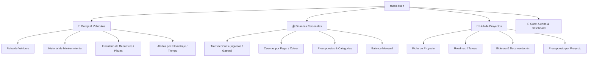

# 🧠 racso-brain — Plan de Producto y Desglose de Features

## 1. Visión del Producto

**racso-brain** es un sistema integral de gestión personal ("Second Brain" operativo) diseñado para centralizar y dar trazabilidad a tres pilares clave del día a día:

1. **Mantenimiento y vida útil de activos físicos (Vehículos)**.
2. **Salud financiera (Ingresos, Gastos, Compromisos y Pagos Pendientes)**.
3. **Seguimiento operativo y bitácora de Proyectos personales/profesionales**.

---

## 2. Desglose de Módulos y Features

---

### Módulo 1: Garaje y Mantenimiento de Vehículos 🚗

_Objetivo: Saber exactamente qué se le hizo a cada vehículo, cuándo, con qué pieza y cuándo le toca el próximo servicio._

- **Feature 1.1 — Perfil del Vehículo:**
  - Registro de vehículos (marca, modelo, año, placa/VIN, foto, kilometraje actual).
  - Configuración de intervalos recomendados (ej. cambio de aceite cada 5,000 km o 6 meses).
- **Feature 1.2 — Bitácora de Mantenimientos & Reparaciones:**
  - Registro de eventos: fecha, kilometraje al momento, tipo de servicio (preventivo vs correctivo), taller/mecánico, costo de mano de obra.
  - Asociación de piezas reemplazadas (marca, número de parte, costo, garantía).
- **Feature 1.3 — Próximos Servicios & Alertas:**
  - Cálculo automático del próximo mantenimiento estimado por tiempo o extrapolación de kilometraje.
  - Semáforo de estado: _Al día_, _Próximo a vencer_, _Vencido_.
- **Feature 1.4 — Historial de Gastos de Combustible / Inspecciones (Fase 2):**
  - Registro de inspecciones legales, seguros, renovaciones anuales de permisos.

---

### Módulo 2: Finanzas Personales 💰

_Objetivo: Control claro del flujo de caja, gastos fijos y calendario de pagos pendientes para evitar moras o sorpresas._

- **Feature 2.1 — Registro de Transacciones:**
  - Ingresos y egresos clasificados por categorías y subcategorías configurables.
  - Soporte multi-cuenta o métodos de pago (efectivo, bancos, tarjetas).
- **Feature 2.2 — Pagos Pendientes y Compromisos:**
  - Agenda de cuentas por pagar con fecha de vencimiento (servicios, tarjetas, préstamos, alquiler).
  - Estado del pago: _Pendiente_, _Programado_, _Pagado_.
  - Alerta de pagos próximos a vencer en los siguientes 7 días.
- **Feature 2.3 — Cuentas por Cobrar (Inflow diferido):**
  - Dinero pendiente que terceros deben pagar.
- **Feature 2.4 — Balance y Reportes Básicos:**
  - Resumen mensual: Total ingresos vs Total egresos vs Saldo neto.
  - Gastos por categoría (gráfico de torta / barras).

---

### Módulo 3: Hub de Proyectos 📂

_Objetivo: Tener un espacio dedicado para proyectos activos con sus notas, requerimientos, enlaces y avances._

- **Feature 3.1 — Ficha de Proyecto:**
  - Título, descripción, objetivo, fecha límite, prioridad y estado (_Idea_, _En Progreso_, _Pausado_, _Completado_).
- **Feature 3.2 — Tareas y Milestones:**
  - Lista de tareas / checklist por proyecto o vista Kanban básica.
- **Feature 3.3 — Bitácora y Enlaces:**
  - Registro de notas de avance cronológicas.
  - Sección de links útiles, recursos, credenciales o documentación relacionada.
- **Feature 3.4 — Costos vinculados (Opcional - Cruce con Finanzas):**
  - Posibilidad de asociar gastos del módulo de Finanzas a un proyecto específico.

---

### Módulo Core / Dashboard Principal 📊

- **Vista consolidada ("At a Glance"):**
  - 🚨 **Alertas críticas:** Mantenimiento de vehículo vencido + pagos que vencen esta semana.
  - 📈 **Widget Financiero:** Balance del mes en curso.
  - 📌 **Widget Proyectos:** Proyectos en progreso con entregas próximas.

---

## 3. Hoja de Ruta Sugerida (Roadmap MVP)

| Fase                   | Alcance                                                                                       | Entregable                                      |
| :--------------------- | :-------------------------------------------------------------------------------------------- | :---------------------------------------------- |
| **Fase 1 (MVP Base)**  | Modelo de datos común + Módulo Vehículos completo + Transacciones y Pagos pendientes básicos. | App funcional con registro y bitácoras clave.   |
| **Fase 2 (Expansión)** | Módulo de Proyectos + Dashboard consolidado con alertas de vencimiento.                       | Integración de los 3 módulos en una sola vista. |
| **Fase 3 (Analytics)** | Métricas avanzadas, predicciones de kilometraje, reportes financieros exportables.            | Optimización y automatizaciones.                |

---

## 4. Preguntas para Definir el Alcance Técnico

Para avanzar hacia la arquitectura y especificación (SDD):

1. **Plataforma objetivo:** ¿Prefieres una **Web App responsive** (accesible desde móvil y PC), una **Desktop App** (ej. Tauri/Electron), o **CLI / Terminal**?
2. **Almacenamiento:** ¿Prefieres que los datos sean **100% locales** (ej. SQLite / DuckDB en tu máquina) o te gustaría sincronización con la nube (ej. Supabase / PostgreSQL)?
3. **Preferencia de Stack:** ¿Hay algún framework o lenguaje con el que te sientas más cómodo para este proyecto (ej. Next.js/React, Svelte, Vue, Go/Python backend, etc.)?
