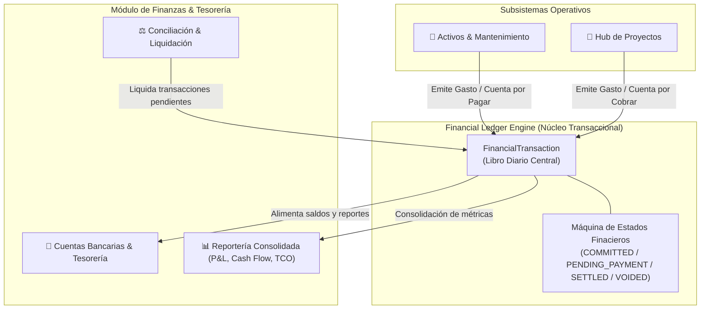
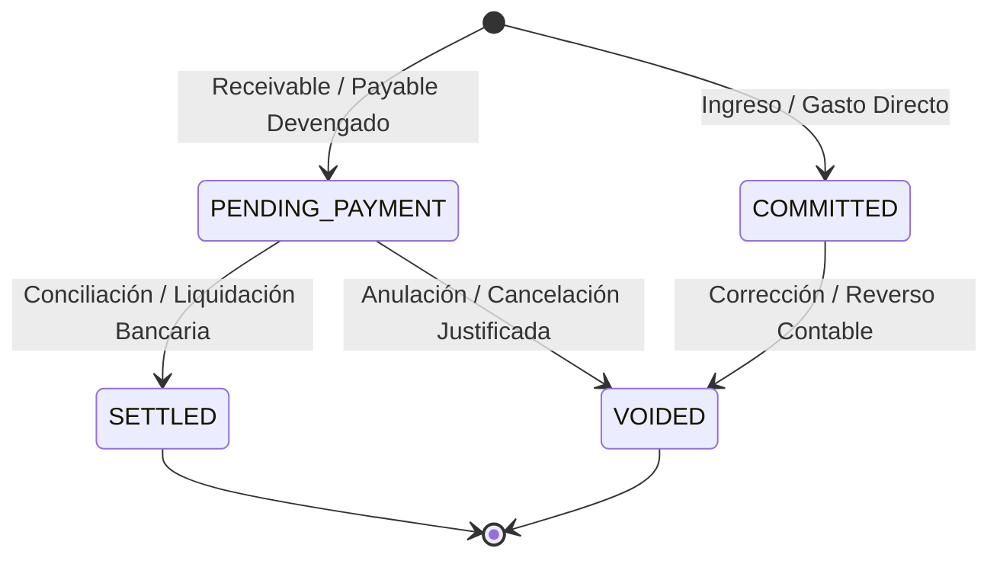
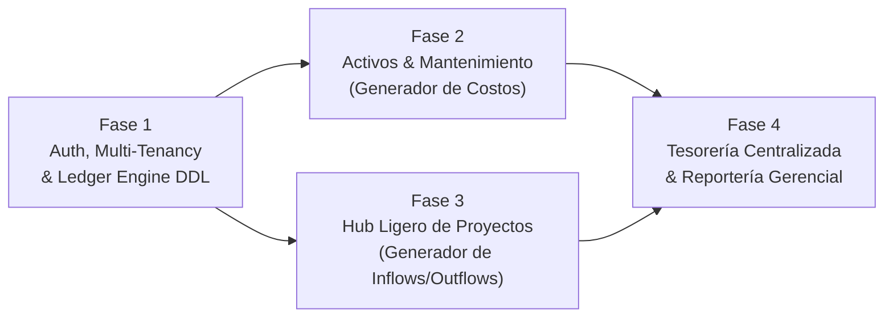

# 🗺️ racso-brain — Roadmap de Desarrollo y Arquitectura de Features

Este documento establece el plan integral de ingeniería, arquitectura de datos y secuencia de desarrollo para **racso-brain**, estructurado en cuatro features principales y cimentado sobre un motor transaccional desacoplado (**Financial Ledger Engine**).

---

## 1. Visión General y Arquitectura Transversal

### 1.1 El Desafío del Acoplamiento Financiero
En arquitecturas operativas tradicionales, los módulos de negocio (mantenimiento de activos, gestión de proyectos, compras operativas) suelen insertar o modificar registros financieros directamente en tablas de tesorería. Esto introduce tres problemas críticos:
1. **Falta de inmutabilidad y auditoría:** Dificultad para rastrear qué evento operativo generó qué obligación económica.
2. **Duplicidad de estados de cobro y pago:** Múltiples lógicas dispares para saber si una factura o servicio ya fue liquidado.
3. **Alto acoplamiento:** Cambios en el motor contable o bancario rompen los módulos operativos.

### 1.2 La Solución: Financial Ledger Engine (Libro Diario Transaccional)
El **Financial Ledger Engine** actúa como mediador unificado e intermediario inmutable entre los subsistemas operativos y la tesorería central:
- Todo evento con repercusión económica emite una transacción (`FinancialTransaction`) hacia el Ledger.
- Los módulos operativos no tocan balances bancarios; únicamente declaran el hecho económico (ej. gasto incurrido, compromiso por pagar, cuenta por cobrar generada).
- El Ledger centraliza el ciclo de vida de cobro/pago, facilitando reconciliaciones bancarias y auditorías sin interferir con las operaciones diarias.



### 1.3 Modelo de Transacciones y Máquina de Estados

Cada registro económico en `financial_transactions` posee un **Tipo** y un **Estado**:

#### Tipos de Transacción (`TransactionType`)
- `INCOME`: Ingreso directo realizado o registrado en tesorería.
- `EXPENSE`: Gasto o egreso directo devengado inmediatamente.
- `RECEIVABLE`: Cuenta por cobrar (compromiso de cobro diferido hacia un cliente o proyecto).
- `PAYABLE`: Cuenta por pagar (obligación o deuda devengada con proveedor/taller por liquidar).

#### Estados de Transacción (`TransactionStatus`)
- `COMMITTED`: Transacción confirmada en firme, devengada formalmente en libros sin requerir ciclo diferido de pago (típico de ingresos/gastos directos al contado).
- `PENDING_PAYMENT`: Obligación de pago o derecho de cobro pendiente de ser liquidado en cuenta financiera (`PAYABLE` o `RECEIVABLE`).
- `SETTLED`: Transacción completamente liquidada contra una cuenta bancaria/caja registrada en tesorería.
- `VOIDED`: Transacción anulada o revertida con justificación de auditoría (no se elimina físicamente el registro para preservar trazabilidad).



---

## 2. Feature 1: Auth & Multi-Tenancy (Base de la Plataforma)

### 2.1 Principios de Seguridad y Aislamiento Multi-Tenant
- **Aislamiento Estricto por Tenant:** Todas las tablas maestras y transaccionales poseen obligatoriamente la columna `tenant_id UUID NOT NULL REFERENCES tenants(id)`.
- **Row-Level Security (RLS) & Filtros Globales:** Políticas de acceso a nivel de base de datos o middleware de ORM que impiden fugas de datos entre organizaciones.
- **Sesiones y Autenticación:** Tokens JWT con rotación de claves, sesiones con invalidación remota, hashing de contraseñas con Argon2id / bcrypt.

### 2.2 Matriz de Roles y Permisos (RBAC Granular)

| Rol | Permisos Clave | Acceso a Datos Sensibles |
| :--- | :--- | :--- |
| **SuperAdmin** | Gestión global de tenants, configuración de sistema y auditoría completa. | Sí (Acceso Total) |
| **TenantAdmin** | Administración de usuarios del tenant, roles, cuentas bancarias y parámetros. | Sí (Dentro del tenant) |
| **ProjectManager** | Crear/editar proyectos, bitácoras operativas, emisión de cuentas por cobrar. | Parcial (Notas no sensibles por defecto; notas sensibles si tiene flag) |
| **MaintenanceOperator** | Gestión de activos, odómetros, órdenes de servicio y reporte de gastos mecánicos. | No |
| **FinancialAuditor** | Vista de solo lectura a ledger, tesorería, reportes de P&L y balances consolidados. | Sí (Área financiera) |

### 2.3 Esquema DDL Inicial: Multi-Tenancy & Financial Ledger Engine

```sql
-- Habilitación de extensión UUID
CREATE EXTENSION IF NOT EXISTS "uuid-ossp";

-- 1. Tabla de Organizaciones / Tenants
CREATE TABLE tenants (
    id UUID PRIMARY KEY DEFAULT uuid_generate_v4(),
    slug VARCHAR(64) UNIQUE NOT NULL,
    name VARCHAR(255) NOT NULL,
    is_active BOOLEAN NOT NULL DEFAULT TRUE,
    created_at TIMESTAMPTZ NOT NULL DEFAULT NOW(),
    updated_at TIMESTAMPTZ NOT NULL DEFAULT NOW()
);

-- 2. Usuarios y Autenticación
CREATE TABLE users (
    id UUID PRIMARY KEY DEFAULT uuid_generate_v4(),
    tenant_id UUID NOT NULL REFERENCES tenants(id) ON DELETE RESTRICT,
    email VARCHAR(255) NOT NULL,
    password_hash VARCHAR(255) NOT NULL,
    first_name VARCHAR(100) NOT NULL,
    last_name VARCHAR(100) NOT NULL,
    is_active BOOLEAN NOT NULL DEFAULT TRUE,
    created_at TIMESTAMPTZ NOT NULL DEFAULT NOW(),
    updated_at TIMESTAMPTZ NOT NULL DEFAULT NOW(),
    CONSTRAINT uq_tenant_user_email UNIQUE (tenant_id, email)
);

-- 3. Roles y Asignaciones
CREATE TABLE roles (
    id UUID PRIMARY KEY DEFAULT uuid_generate_v4(),
    tenant_id UUID NOT NULL REFERENCES tenants(id) ON DELETE CASCADE,
    code VARCHAR(64) NOT NULL,
    name VARCHAR(100) NOT NULL,
    permissions JSONB NOT NULL DEFAULT '[]'::jsonb,
    created_at TIMESTAMPTZ NOT NULL DEFAULT NOW(),
    CONSTRAINT uq_tenant_role_code UNIQUE (tenant_id, code)
);

CREATE TABLE user_roles (
    user_id UUID NOT NULL REFERENCES users(id) ON DELETE CASCADE,
    role_id UUID NOT NULL REFERENCES roles(id) ON DELETE CASCADE,
    PRIMARY KEY (user_id, role_id)
);

-- 4. Tipos Enumerados del Ledger
CREATE TYPE financial_tx_type AS ENUM ('INCOME', 'EXPENSE', 'RECEIVABLE', 'PAYABLE');
CREATE TYPE financial_tx_status AS ENUM ('COMMITTED', 'PENDING_PAYMENT', 'SETTLED', 'VOIDED');

-- 5. Financial Ledger Engine (Libro Diario Centralizado)
CREATE TABLE financial_transactions (
    id UUID PRIMARY KEY DEFAULT uuid_generate_v4(),
    tenant_id UUID NOT NULL REFERENCES tenants(id) ON DELETE RESTRICT,
    tx_type financial_tx_type NOT NULL,
    status financial_tx_status NOT NULL DEFAULT 'COMMITTED',
    amount NUMERIC(14, 2) NOT NULL CHECK (amount > 0),
    currency VARCHAR(3) NOT NULL DEFAULT 'USD',
    issue_date DATE NOT NULL DEFAULT CURRENT_DATE,
    due_date DATE,
    settled_at TIMESTAMPTZ,
    
    -- Referencia Polimórfica de Origen (Asset, Project, Invoice, Direct)
    origin_module VARCHAR(64) NOT NULL,
    origin_id UUID,

    category VARCHAR(100) NOT NULL,
    description TEXT NOT NULL,
    metadata JSONB NOT NULL DEFAULT '{}'::jsonb,
    
    created_by UUID REFERENCES users(id) ON DELETE SET NULL,
    created_at TIMESTAMPTZ NOT NULL DEFAULT NOW(),
    updated_at TIMESTAMPTZ NOT NULL DEFAULT NOW()
);

CREATE INDEX idx_fin_tx_tenant_module ON financial_transactions(tenant_id, origin_module, origin_id);
CREATE INDEX idx_fin_tx_tenant_status ON financial_transactions(tenant_id, status);
CREATE INDEX idx_fin_tx_issue_date ON financial_transactions(tenant_id, issue_date);
```

---

## 3. Feature 2: Activos / Objetos Mantenibles Genéricos

### 3.1 Modelo Polimórfico Extensible
Para evitar restringir el sistema únicamente a automóviles, el subsistema de mantenimiento abstrae el concepto de **Activo Operativo**:
- **Tipos de Activos:** Vehículos ligeros, camiones/flotas, unidades HVAC/climatización, maquinaria pesada, plantas eléctricas, herramientas de precisión.
- **Atributos Dinámicos:** Mediante `metadata JSONB` se almacenan especificaciones especializadas (VIN, refrigerante, potencia en kVA, especificaciones de lubricante) sin requerir alteraciones de esquema para nuevos tipos de equipo.

### 3.2 Métricas de Uso y Desgaste Multivariable
El mantenimiento preventivo no depende de una sola unidad. Se soportan múltiples tipos de medidores:
1. **Odómetro:** Distancia acumulada (Kilómetros / Millas).
2. **Horómetro:** Horas operativas del motor o compresor.
3. **Ciclos:** Conteo de arranques, elevaciones o ciclos de carga.
4. **Tiempo Calendario:** Días o meses transcurridos desde la última intervención.

### 3.3 Órdenes de Mantenimiento Preventivo y Correctivo
- **Preventivo:** Basado en umbrales de servicio configurables (ej. cada 7,500 km o 250 horas motor). Genera alertas con semáforo de proximidad (*Normal*, *Próximo a Vencer*, *Vencido*).
- **Correctivo:** Registro de fallas, diagnósticos, piezas reemplazadas, técnico/taller externo involucrado y tiempo fuera de servicio.

### 3.4 Conexión Automática con el Ledger Engine
Al cerrar o confirmar una orden de trabajo:
- Si el servicio fue pagado de inmediato con tarjeta/caja chica: Emite `EXPENSE` con estado `COMMITTED`.
- Si el taller emite una factura con crédito a 15/30 días: Emite `PAYABLE` con estado `PENDING_PAYMENT` y fecha de vencimiento (`due_date`).
- Ambas transacciones guardan `origin_module = 'ASSET_MAINTENANCE'` y `origin_id = maintenance_order_id`, asociando el gasto al costo total del activo.

---

## 4. Feature 3: Hub Ligero de Proyectos

### 4.1 Filosofía de Diseño: Ágil y Sin Sobrecarga
El Hub de Proyectos prioriza la visibilidad ejecutiva y el control financiero sobre la microgestión de tareas excesivamente burocráticas:
- **Ficha del Proyecto:** Nombre, código, cliente/contraparte, descripción sintética, fechas clave (inicio planificado, fin pactado, cierre real) y estado (`PLANNED`, `ACTIVE`, `ON_HOLD`, `COMPLETED`, `CANCELLED`).
- **Bitácora de Notas con Control de Confidencialidad:**
  - Registro cronológico de acuerdos, minutas y avances.
  - Flag de privacidad: `is_sensitive: boolean`. Las notas marcadas como confidenciales (ej. honorarios, incidentes contractuales, acuerdos estratégicos) solo son visibles para usuarios con el permiso `project:read_sensitive`.

### 4.2 Finanzas Directas del Proyecto & Accounts Receivable
Cada proyecto mantiene su balance económico en tiempo real a través del Ledger Engine:
- **Egresos Directos:** Materiales, subcontratistas y viáticos vinculados con `origin_module = 'PROJECT'` y `origin_id = project_id`.
- **Ingresos y Cuentas por Cobrar (*Accounts Receivable*):**
  - Registro de hitos de cobro acordados con el cliente como `RECEIVABLE` en estado `PENDING_PAYMENT`.
  - Al recibir el pago del cliente, la transacción pasa a `SETTLED` vinculando la cuenta bancaria de recepción.

### 4.3 Métricas Financieras en Tiempo Real por Proyecto
El dashboard de cada proyecto calcula al instante:
1. **Caja Realizada (*Realized Cash Flow*):** `Ingresos SETTLED - Gastos COMMITTED/SETTLED`.
2. **Cobros Pendientes (*Pending Receivables*):** Suma total de `RECEIVABLE` en estado `PENDING_PAYMENT`.
3. **Margen Proyectado (*Projected Margin*):** `(Ingresos Totales Comprometidos - Costos Totales Incurridos) / Ingresos Totales`.

---

## 5. Feature 4: Finanzas Centralizadas & Reportería

### 5.1 Tesorería y Cuentas Financieras
- Catálogo de cuentas financieras del tenant (cuentas bancarias corporativas, cuentas en moneda extranjera, cajas chicas, billeteras digitales).
- Control de saldos conciliados y trazabilidad de movimientos.

### 5.2 Liquidación y Conciliación
- **Liquidación de Cuentas por Pagar (`PAYABLE` -> `SETTLED`):** Selección de obligaciones devengadas por órdenes de mantenimiento o compras de proyectos, afectando la cuenta bancaria de egreso.
- **Cobro de Cuentas por Cobrar (`RECEIVABLE` -> `SETTLED`):** Registro de transferencias de clientes contra facturas o hitos abiertos.
- **Auditoría de Inconsistencias:** Reporte de partidas abiertas, días promedio de cobro (DSO) y obligaciones vencidas.

### 5.3 Reportería Gerencial Consolidada
El módulo de finanzas consolida los datos provenientes del Ledger Engine para entregar:
1. **Estado de Resultados (P&L):** Ingresos devengados vs. Egresos operativos clasificados por categorías y centros de costo.
2. **Flujo de Caja (*Cash Flow*):** Entradas y salidas efectivas en rangos semanales y mensuales para evaluar liquidez real.
3. **Costo Total de Propiedad (*TCO - Total Cost of Ownership*) por Activo:**
   $$\text{TCO} = \text{Costo de Adquisición} + \sum \text{Mantenimientos} + \sum \text{Consumibles} - \text{Valor Residual}$$
4. **Rentabilidad Comparativa de Proyectos:** Comparación de margen proyectado vs. margen realizado por proyecto, identificando desviaciones presupuestarias.

---

## 6. Secuencia de Desarrollo y Dependencias

La arquitectura se desarrollará de forma secuencial y acumulativa, garantizando que cada fase cuente con sus cimientos antes de integrarse:



### Justificación Técnica de la Secuencia:
1. **Fase 1 (Plataforma Base & Ledger Engine):** Es imprescindible contar con el aislamiento multi-tenant y la estructura DDL de `financial_transactions` para que los módulos posteriores tengan un destino unificado donde asentar transacciones.
2. **Fase 2 (Activos y Mantenimiento):** Implementa el modelo de hardware/activos físicos y pone a prueba la emisión de compromisos de gasto (`EXPENSE` y `PAYABLE`) en el Ledger.
3. **Fase 3 (Hub Ligero de Proyectos):** Incorpora la gestión de flujos mixtos (costos directos y cobros `RECEIVABLE`), validando la máquina de estados con cuentas por cobrar y notas confidenciales.
4. **Fase 4 (Finanzas Centralizadas y Reportería):** Cierra el ciclo con tesorería bancaria, liquidación/conciliación de partidas pendientes y analítica consolidada (Cash Flow, P&L, TCO y ROI).
