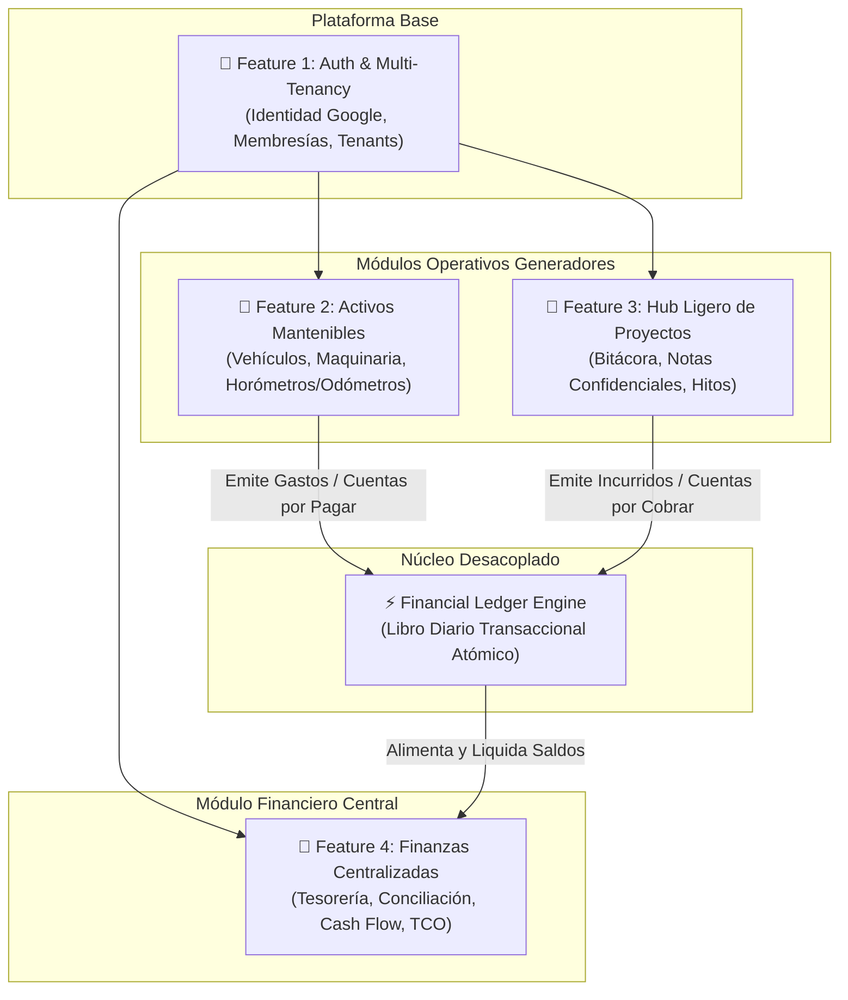
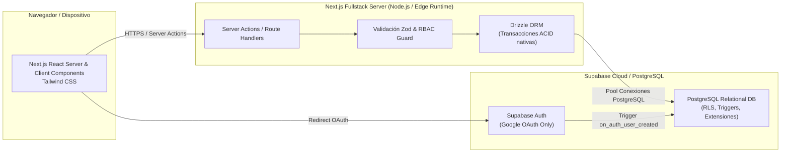
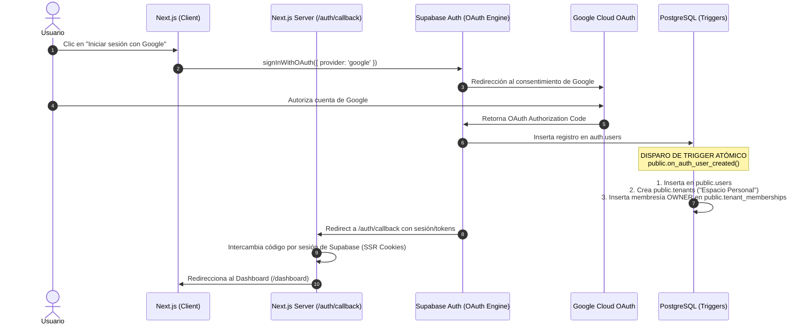
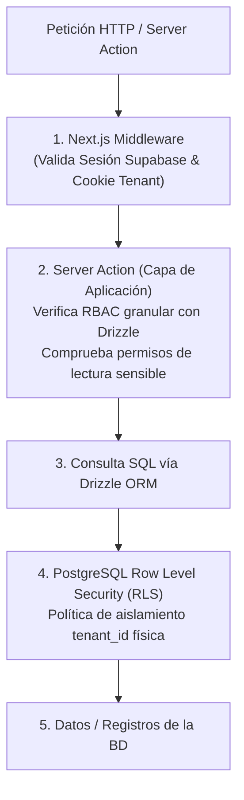
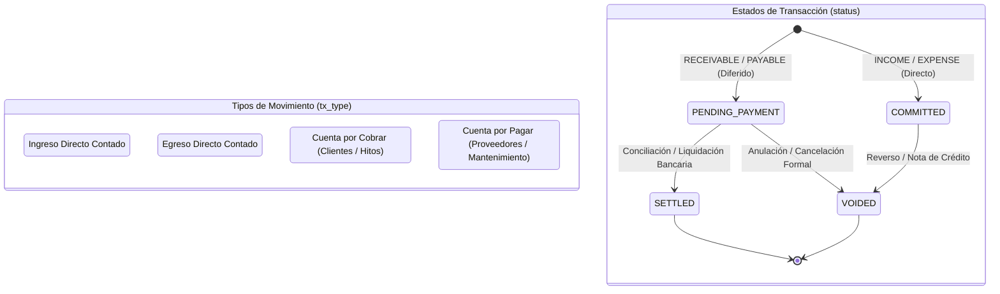

# 🏛️ ADR 001: Arquitectura Fundacional, Stack Tecnológico y Modelo Multi-Tenant de racso-brain

| Metadato | Detalle |
| :--- | :--- |
| **Código ADR** | `ADR-001` |
| **Título** | Arquitectura Fundacional, Stack Tecnológico y Aislamiento Multi-Tenant |
| **Estado** | **Aprobado / Accepted** |
| **Fecha** | 2026-09-17 |
| **Decisores** | Equipo de Ingeniería y Producto de racso-brain |
| **Documentos Relacionados** | [`docs/first-idea.md`](file:///Users/racso/work/racso/racso-brain/docs/first-idea.md), [`docs/roadmap-features.md`](file:///Users/racso/work/racso/racso-brain/docs/roadmap-features.md) |

---

## 1. Contexto y Propósito del Sistema

**racso-brain** nace como una plataforma integral de gestión operativa y financiera personal/profesional ("Second Brain" operativo). Su objetivo es consolidar en una única interfaz reactiva y confiable el ciclo de vida de los activos físicos, los proyectos en ejecución y los flujos de tesorería, eliminando la dispersión de datos en hojas de cálculo y notas desconectadas.

La plataforma está estructurada formalmente en cuatro pilares o features funcionales:



1. **Feature 1 — Auth & Multi-Tenancy:** Cimiento de identidad, aislamiento de datos organizacionales y control de acceso basado en roles (RBAC).
2. **Feature 2 — Activos / Objetos Mantenibles Genéricos:** Abstracción polimórfica para vehículos, maquinaria y equipos, con soporte multivariable (odómetro, horómetro, ciclos) y generación automática de costos.
3. **Feature 3 — Hub Ligero de Proyectos:** Seguimiento ágil de iniciativas, bitácora cronológica con control de confidencialidad y control de cuentas por cobrar (*Accounts Receivable*).
4. **Feature 4 — Finanzas Centralizadas & Reportería:** Cuentas bancarias, liquidación de partidas pendientes, flujo de caja proyectado y cálculo del Costo Total de Propiedad (TCO).

---

## 2. Stack Tecnológico Seleccionado (Opción 1: Fullstack Next.js + Supabase)

### 2.1 Componentes Principales del Stack

Para garantizar velocidad de entrega, consistencia de tipos de extremo a extremo y máxima robustez en concurrencia y persistencia, se ha seleccionado el enfoque **Fullstack Next.js + Supabase + Drizzle ORM**:



#### A. Framework Web: Next.js (App Router) + TypeScript + Tailwind CSS
- **App Router & React Server Components (RSC):** Permite renderizar vistas complejas y ejecutar consultas a base de datos en el servidor sin exponer secretos ni sobrecargar el bundle del cliente con lógica de negocio.
- **Server Actions:** Manejo idiomático de mutaciones seguras (creación de órdenes de mantenimiento, asientos en el Ledger, proyectos) con validación estricta en el servidor y revalidación de caché bajo demanda (`revalidatePath`).
- **Tailwind CSS:** Diseño visual utilitario, modular y altamente responsivo para optimizar la experiencia en escritorios y dispositivos móviles sin acoplarse a librerías de UI pesadas.
- **TypeScript:** Tipado estricto en toda la base de código.

#### B. Base de Datos: PostgreSQL alojado en Supabase
- **Motor Relacional Maduro:** Soporte para claves foráneas, restricciones de unicidad compuestas, índices parciales y tipos enumerados nativos (`ENUM`).
- **Capacidades JSONB:** Permite extender especificaciones dinámicas de activos (fichas técnicas, números de parte, especificaciones de lubricante) sin migraciones destructivas.
- **Infraestructura Gestionada:** Alta disponibilidad, backups automatizados y extensiones esenciales (`uuid-ossp`, `pgcrypto`).

#### C. Capa de Persistencia: Drizzle ORM
- **Transacciones ACID Nativas:** Soporte directo para `db.transaction()` sincrónico y seguro, indispensable para el Financial Ledger Engine.
- **Sin Sobrecarga de Runtime (Zero-Overhead):** A diferencia de Prisma, Drizzle es un query builder tipado ligero que compila a SQL directo sin binarios pesados ni motores Rust intermediarios.
- **Drizzle Kit:** Migraciones versionadas en archivos `.sql` reproducibles y auditables bajo control de versiones.
- **Integración con Zod (`drizzle-zod`):** Generación automática de esquemas de validación a partir del esquema de base de datos, garantizando type-safety end-to-end (DB -> Server -> Client).

---

## 3. Estrategia de Autenticación y Enrollment

### 3.1 Exclusividad con Google OAuth (Gmail)

Se descarta el uso de credenciales tradicionales (usuario/contraseña) y magic links por las siguientes razones de arquitectura:
- **Reducción de superficie de ataque:** Se elimina la gestión de hashes de contraseñas, ataques de fuerza bruta, políticas de cambio de clave y recuperación de cuentas en el backend propio.
- **Fricción mínima de usuario:** Acceso en un solo clic validado contra las credenciales seguras de Google Workspace o cuentas personales de Gmail.
- **Autenticación Delegada Confiable:** Google garantiza autenticación de dos factores (2FA) y verificación de identidad probada.

### 3.2 Desactivación de Métodos Convencionales
En la consola de Supabase Auth:
- Proveedor de Email/Password: **Deshabilitado**.
- Proveedor de Magic Link / OTP: **Deshabilitado**.
- Proveedores sociales secundarios: **Deshabilitados** (solo Google activo).
- Confirmación de email automática delegada en Google (`email_verified: true`).

### 3.3 Diagrama de Secuencia: Flujo de Onboarding / Enrollment



---

## 4. Arquitectura Multi-Inquilino (Multi-Tenancy) y Sincronización

### 4.1 Desacoplamiento de `auth.users` y `public.users`

Para mantener la base de datos portable e independiente de la infraestructura de identidad de Supabase, se implementa una separación estricta:
- `auth.users`: Esquema interno privado administrado por Supabase Auth. Almacena metadatos del proveedor Google, tokens y credenciales base. Ninguna tabla de negocio se relaciona directamente con este esquema.
- `public.users`: Tabla del dominio de la aplicación. Contiene el identificador de usuario `id` (referenciando `auth.users(id)`), nombre, correo, avatar y preferencias de usuario.

### 4.2 Database Trigger de Aprovisionamiento Automático (`on_auth_user_created`)

Cuando un usuario nuevo inicia sesión mediante Google por primera vez, un trigger a nivel de PostgreSQL inicializa de forma atómica su entorno de trabajo para evitar estados inconsistentes:

```sql
-- 1. Función manejadora del evento de nuevo usuario
CREATE OR REPLACE FUNCTION public.handle_new_user()
RETURNS TRIGGER
LANGUAGE plpgsql
SECURITY DEFINER SET search_path = public
AS $$
DECLARE
    v_user_name TEXT;
    v_tenant_id UUID;
    v_first_name TEXT;
    v_last_name TEXT;
BEGIN
    -- Extracción de metadatos provistos por Google OAuth
    v_first_name := COALESCE(NEW.raw_user_meta_data->>'given_name', split_part(NEW.email, '@', 1));
    v_last_name  := COALESCE(NEW.raw_user_meta_data->>'family_name', '');
    v_user_name  := TRIM(v_first_name || ' ' || v_last_name);

    -- Paso 1: Crear el perfil público del usuario
    INSERT INTO public.users (
        id,
        email,
        full_name,
        avatar_url,
        created_at,
        updated_at
    ) VALUES (
        NEW.id,
        NEW.email,
        v_user_name,
        NEW.raw_user_meta_data->>'avatar_url',
        NOW(),
        NOW()
    );

    -- Paso 2: Crear el Tenant por defecto (Espacio Personal)
    INSERT INTO public.tenants (
        name,
        slug,
        is_active,
        created_at,
        updated_at
    ) VALUES (
        'Espacio Personal de ' || v_first_name,
        'workspace-' || SUBSTRING(NEW.id::TEXT, 1, 8),
        TRUE,
        NOW(),
        NOW()
    )
    RETURNING id INTO v_tenant_id;

    -- Paso 3: Asignar la membresía inicial con rol OWNER
    INSERT INTO public.tenant_memberships (
        user_id,
        tenant_id,
        role,
        is_default,
        created_at,
        updated_at
    ) VALUES (
        NEW.id,
        v_tenant_id,
        'OWNER',
        TRUE,
        NOW(),
        NOW()
    );

    RETURN NEW;
END;
$$;

-- 2. Trigger vinculado a la tabla privada de Supabase
DROP TRIGGER IF EXISTS on_auth_user_created ON auth.users;
CREATE TRIGGER on_auth_user_created
    AFTER INSERT ON auth.users
    FOR EACH ROW EXECUTE FUNCTION public.handle_new_user();
```

### 4.3 Soporte Futuro: Múltiples Organizaciones e Invitaciones
El modelo de datos separa deliberadamente la entidad `tenants` de `users` a través de una tabla asociativa `tenant_memberships`. Esto permite de forma transparente:
- Que un mismo usuario pertenezca a múltiples organizaciones o espacios de trabajo (ej. Espacio Personal + Empresa de Consultoría + Taller Mecánico).
- Invitar a nuevos usuarios mediante correo electrónico con roles específicos (`ADMIN`, `PROJECT_MANAGER`, `MAINTENANCE_OPERATOR`, `AUDITOR`, `MEMBER`).
- Selección activa de tenant mediante header o cookie de contexto (`active_tenant_id`).

---

## 5. Modelo de Seguridad y Autorización (Enfoque Híbrido)

El sistema adopta una arquitectura de **Defensa en Profundidad (Defense-in-Depth)** estructurada en dos niveles:



### 5.1 Capa de Aplicación (Server Actions & Middleware)
- **Extracción de Contexto:** El middleware y las funciones core extraen el `user_id` autenticado y el `tenant_id` seleccionado desde la sesión SSR cifrada.
- **Validación RBAC Rápida:** Antes de invocar la persistencia, la Server Action verifica si el rol del usuario en `tenant_memberships` tiene concedida la acción solicitada.
- **Validación de Entradas:** Todas las mutaciones pasan por esquemas Zod estrictos (`z.object(...)`) que impiden inyecciones y datos malformados.

### 5.2 Capa de Base de Datos: Row Level Security (RLS)
PostgreSQL actúa como la última línea de defensa física en caso de fallo u omisión en la capa de software:
- Todas las tablas del dominio poseen la columna obligatoria:
  ```sql
  tenant_id UUID NOT NULL REFERENCES public.tenants(id) ON DELETE CASCADE
  ```
- Se activan políticas RLS que comprueban la correspondencia del tenant actual utilizando los claims del token JWT de Supabase o variables de sesión de PostgreSQL:
  ```sql
  ALTER TABLE public.financial_transactions ENABLE ROW LEVEL SECURITY;

  CREATE POLICY tenant_isolation_policy ON public.financial_transactions
      FOR ALL
      USING (
          tenant_id IN (
              SELECT tm.tenant_id 
              FROM public.tenant_memberships tm
              WHERE tm.user_id = auth.uid()
          )
      );
  ```

### 5.3 Tratamiento de Datos Confidenciales (Notas Sensibles de Proyectos)
En el Hub de Proyectos (`Feature 3`), las notas de bitácora pueden contener tarifas contractuales, contraseñas temporales o acuerdos estratégicos privados.
- **Flag de Control:** Cada nota incluye la columna `is_sensitive BOOLEAN NOT NULL DEFAULT FALSE`.
- **Control Estricto en Servidor:** Las consultas de Server Actions excluyen por defecto o censuran el campo `content` de notas sensibles a menos que el usuario posea el permiso explícito `projects.notes:read_sensitive` o rol `OWNER` / `ADMIN`.
- **Cifrado en Reposo (At-Rest Encryption):** Para notas de extrema confidencialidad, el contenido se almacena cifrado en la columna `encrypted_content TEXT` utilizando AES-256-GCM antes de persistirse en la base de datos, manteniendo la clave de cifrado exclusivamente en las variables de entorno seguras del servidor (`NOTE_ENCRYPTION_KEY`).

---

## 6. Arquitectura del Financial Ledger Engine

El **Financial Ledger Engine** resuelve el acoplamiento directo entre subsistemas operativos (activos y proyectos) y la tesorería de la organización.

### 6.1 Principios del Motor
1. **Inmutabilidad y Auditoría:** Los registros del libro no se eliminan físicamente; cualquier corrección o cancelación se ejecuta mediante una transición de estado a `VOIDED` o mediante la emisión de una contra-transacción de compensación.
2. **Desacoplamiento Operativo:** El módulo de Activos no necesita saber qué cuenta bancaria pagó el cambio de aceite; solo emite el gasto devengado. Tesorería se encarga de la liquidación posterior.
3. **Atomicidad Transaccional:** La creación de una orden de trabajo o hito de proyecto y su correspondiente asiento en el Ledger se ejecutan dentro de la misma transacción relacional de base de datos (`db.transaction()`).

### 6.2 Tipos y Estados de Transacción



- **Tipos de Transacción (`financial_tx_type`):**
  - `INCOME`: Entrada de fondos devengada de inmediato.
  - `EXPENSE`: Salida de fondos devengada de inmediato.
  - `RECEIVABLE`: Derecho de cobro diferido hacia un cliente o proyecto.
  - `PAYABLE`: Obligación de pago diferida contraída con un proveedor o taller.
- **Estados de Transacción (`financial_tx_status`):**
  - `COMMITTED`: Transacción confirmada en firme, devengada formalmente sin necesidad de liquidación diferida.
  - `PENDING_PAYMENT`: Partida abierta pendiente de conciliar o transferir contra una cuenta de tesorería.
  - `SETTLED`: Partida efectivamente saldada y registrada en una cuenta bancaria o caja.
  - `VOIDED`: Transacción anulada conservando el historial completo para auditoría.

### 6.3 Garantía de Atomicidad con Drizzle ORM

Ejemplo de implementación de atomicidad garantizada durante el registro de un servicio de mantenimiento:

```typescript
// src/core/ledger/services/record-maintenance-cost.ts
import { db } from "@/db";
import { maintenanceOrders, financialTransactions } from "@/db/schema";

export async function recordMaintenanceService(params: CreateMaintenanceInput) {
  return await db.transaction(async (tx) => {
    // 1. Crear el registro operativo de mantenimiento
    const [order] = await tx.insert(maintenanceOrders).values({
      tenantId: params.tenantId,
      assetId: params.assetId,
      serviceType: params.serviceType,
      currentUsageMetric: params.usageMetric,
      description: params.description,
      performedAt: params.serviceDate,
    }).returning();

    // 2. Determinar si es un egreso directo o cuenta por pagar diferida
    const isCredit = params.paymentTerms === "CREDIT_30_DAYS";
    
    // 3. Crear el asiento atómico en el Financial Ledger
    const [transaction] = await tx.insert(financialTransactions).values({
      tenantId: params.tenantId,
      txType: isCredit ? "PAYABLE" : "EXPENSE",
      status: isCredit ? "PENDING_PAYMENT" : "COMMITTED",
      amount: params.totalAmount,
      currency: params.currency ?? "USD",
      issueDate: params.serviceDate,
      dueDate: isCredit ? params.dueDate : null,
      originModule: "ASSET_MAINTENANCE",
      originId: order.id,
      category: "VEHICLE_MAINTENANCE",
      description: `Mantenimiento de activo: ${params.assetName} - ${params.description}`,
      metadata: {
        orderId: order.id,
        provider: params.providerName,
        invoiceNumber: params.invoiceNumber,
      },
    }).returning();

    return { order, transaction };
  });
}
```

---

## 7. Estructura Modular de Carpetas del Proyecto

El proyecto adopta una estructura basada en características nucleares (*Core Features*) y separación de capas de infraestructura, base de datos e interfaz de usuario:

```
racso-brain/
├── docs/                                # Documentación de arquitectura, ADRs y especificaciones
│   ├── first-idea.md
│   ├── roadmap-features.md
│   └── technical-decisions.md           # [ADR-001] Este documento
├── drizzle/                             # Salida de migraciones SQL generadas por Drizzle Kit
│   └── migrations/
├── src/
│   ├── app/                             # Next.js App Router (Rutas, Páginas, Layouts y Server Actions)
│   │   ├── (auth)/                      # Grupo de rutas públicas de autenticación
│   │   │   ├── login/
│   │   │   └── callback/                # Intercambio OAuth Google
│   │   ├── (dashboard)/                 # Grupo de rutas protegidas del sistema
│   │   │   ├── layout.tsx               # Contexto de Tenant & Navegación Global
│   │   │   ├── page.tsx                 # Dashboard ejecutivo "At a Glance"
│   │   │   ├── assets/                  # Módulo 2: Activos y Mantenimientos
│   │   │   ├── projects/                # Módulo 3: Hub de Proyectos
│   │   │   ├── finances/                # Módulo 4: Tesorería y Ledger
│   │   │   └── settings/                # Ajustes de Organización y Usuarios
│   │   ├── api/                         # Webhooks y endpoints REST (si aplica)
│   │   ├── globals.css                  # Tailwind CSS y variables de diseño
│   │   └── layout.tsx                   # Root Layout
│   │
│   ├── core/                            # Lógica pura de negocio y dominio (independiente de la UI)
│   │   ├── ledger/                      # Financial Ledger Engine
│   │   │   ├── engine.ts                # Máquina de estados y reglas contables
│   │   │   ├── types.ts                 # Tipos de transacción y contratos
│   │   │   └── services/                # Servicios de emisión y liquidación
│   │   ├── tenancy/                     # Multi-Tenancy Engine
│   │   │   ├── context.ts               # Resolución y guardado del tenant activo
│   │   │   └── membership.ts            # Gestión de organizaciones y miembros
│   │   ├── rbac/                        # Control de acceso basado en roles
│   │   │   ├── permissions.ts           # Definición de permisos del sistema
│   │   │   └── guards.ts                # Funciones aserciones y middleware RBAC
│   │   ├── assets/                      # Dominio de activos y métricas operativas
│   │   └── projects/                    # Dominio de proyectos y bitácora
│   │
│   ├── db/                              # Capa de datos con Drizzle ORM
│   │   ├── index.ts                     # Conexión a Supabase PostgreSQL (Client pool)
│   │   └── schema/                      # Definiciones de tablas y esquemas relacionales
│   │       ├── auth.ts                  # Esquema de usuarios públicos y perfiles
│   │       ├── tenancy.ts               # Esquema de tenants y memberships
│   │       ├── ledger.ts                # Esquema de financial_transactions
│   │       ├── assets.ts                # Esquema de activos, lecturas y mantenimientos
│   │       └── projects.ts              # Esquema de proyectos, notas y tareas
│   │
│   ├── lib/                             # Integraciones con clientes externos y utilidades
│   │   ├── supabase/                    # Clientes de Supabase
│   │   │   ├── client.ts                # Cliente para Browser / Client Components
│   │   │   ├── server.ts                # Cliente para Server Components / Server Actions
│   │   │   └── middleware.ts            # Helper para actualización de cookies de sesión
│   │   ├── crypto/                      # Utilidades de cifrado para notas confidenciales
│   │   └── utils.ts                     # Funciones comunes (formato de moneda, fechas)
│   │
│   └── components/                      # Componentes visuales reutilizables
│       ├── ui/                          # Componentes base (Botones, Modales, Inputs)
│       └── shared/                      # Componentes compartidos de negocio (Selector Tenant, LedgerBadge)
│
├── drizzle.config.ts                    # Configuración de Drizzle Kit y migrador
├── tailwind.config.ts                   # Configuración de diseño Tailwind
├── tsconfig.json                        # Configuración de TypeScript con alias @/*
└── package.json                         # Dependencias y scripts de ejecución
```

---

## 8. Consecuencias y Concesiones (Trade-offs & Mitigaciones)

| Decisión | Ventajas | Concesiones / Desafíos | Mitigación |
| :--- | :--- | :--- | :--- |
| **Next.js App Router + Server Actions** | Stack unificado, cero duplicidad de tipos, renderizado rápido y SEO si se requiere. | Modelo mental de caché y ejecución de cookies más exigente que un SPA tradicional. | Uso estricto de las utilidades `@supabase/ssr` recomendadas y Server Actions con tipado Zod. |
| **Supabase Auth + Google OAuth Exclusivo** | Máxima seguridad, sin gestión de contraseñas, enrolamiento inmediato. | Dependencia de cuenta Google para acceder al sistema. | Para el usuario objetivo y su círculo operativo, la disponibilidad de Gmail es total y simplifica la experiencia. |
| **Drizzle ORM sobre Prisma** | Consultas SQL de alto rendimiento, soporte nativo de transacciones ACID para el Ledger, migraciones en SQL puro. | Menor abstracción de relaciones anidadas que Prisma. | Drizzle provee una API relacional declarativa limpia (`db.query`) y control total del SQL generado. |
| **Aislamiento Multi-Tenant Lógico (Shared Database)** | Simplicidad de despliegue, costo mínimo de infraestructura, facilidad para consolidar analítica. | Requiere disciplina estricta para no omitir el filtro de `tenant_id`. | Doble salvaguarda: Validación en capa de servidor + RLS habilitado a nivel de motor en PostgreSQL. |

---

## 9. Próximos Pasos Técnicos

1. **Inicialización del Repositorio:** Configuración del proyecto Next.js con TypeScript, Tailwind CSS y ESLint.
2. **Configuración de Drizzle ORM:** Instalación de dependencias (`drizzle-orm`, `postgres`, `drizzle-kit`, `zod`), definición de `drizzle.config.ts` y conexión con Supabase.
3. **Migración Inicial de Base de Datos:** Creación de tablas `tenants`, `users`, `tenant_memberships` y `financial_transactions`, así como el trigger de sincronización `handle_new_user()`.
4. **Configuración de Supabase SSR:** Implementación de los adaptadores de cookies en `src/lib/supabase` y flujo de autenticación con Google OAuth.

---

# 🚜 ADR 002: Modelo Polimórfico de Activos, Telemetría Multivariable y Enlace Transaccional al Ledger

| Metadato | Detalle |
| :--- | :--- |
| **Código ADR** | `ADR-002` |
| **Título** | Modelo Polimórfico de Activos, Telemetría Multivariable y Enlace Transaccional al Ledger |
| **Estado** | **Aprobado / Accepted** |
| **Fecha** | 2026-09-17 |
| **Decisores** | Equipo de Ingeniería y Producto de racso-brain |
| **Documentos Relacionados** | [`docs/roadmap-features.md`](file:///Users/racso/work/racso/racso-brain/docs/roadmap-features.md), [SDD Feature 2](file:///Users/racso/work/racso/racso-brain/.agents/sdd/2026-09-17_feature_2_generic_assets_maintenance.md), `ADR-001` |

---

## 1. Contexto y Objetivos del Dominio de Activos

La **Feature 2** aborda la gestión de cualquier objeto físico sujeto a desgaste y mantenimiento preventivo o correctivo:
- **Vehículos (`VEHICLE`)**: Autos, camionetas y camiones medidos principalmente por odómetro (`ODOMETER_KM`) y calendario.
- **Climatización (`HVAC`)**: Unidades centrales y mini-splits controlados por horas de operación (`HOURS_OPERATED`) y días calendario.
- **Maquinaria Pesada (`HEAVY_MACHINERY`)**: Retroexcavadoras, generadores y montacargas monitoreados por horómetros de motor y ciclos de trabajo.
- **Equipos Industriales y Herramientas (`EQUIPMENT`)**: Compresores, bombas y transformadores.
- **Instalaciones e Inmuebles (`FACILITY`)**: Naves industriales, oficinas y bodegas sujetos a rutinas de inspección periódicas.

Cada tipo de activo posee especificaciones técnicas disímiles (VIN, BTU, modelo de motor, voltaje, etc.), pero comparte idénticos ciclos de gobernanza operativa: registro telemático de uso, planes de mantenimiento preventivo, emisión de órdenes de trabajo e impacto financiero en el libro mayor.

---

## 2. Decisión de Arquitectura de Datos: Modelo Polimórfico Flexible

Se evaluaron dos alternativas para modelar activos con diferentes atributos técnicos:
1. **Table-per-Type (TPT):** Una tabla raíz `assets` y múltiples tablas hijas (`vehicles`, `hvac_units`, etc.) vinculadas por clave foránea.
2. **Single Table con JSONB Indexado y Discriminador Zod (Seleccionada):** Una única tabla maestra `assets` que encapsula los atributos comunes y delega las especificaciones técnicas en la columna `custom_fields JSONB`, validada estrictamente en el backend mediante un discriminante polimórfico en tiempo de ejecución.

### Justificación:
- **Principio Abierto/Cerrado (Regla 4):** Agregar una nueva categoría de activo no requiere migraciones DDL estructurales destructivas ni sentencias `ALTER TABLE`.
- **Rendimiento de Consulta:** Elimina la necesidad de `LEFT JOIN` hacia múltiples tablas hijas para listar inventarios heterogéneos.
- **Integridad Garantizada:** Zod (`validateAssetCustomFields`) actúa como el gatekeeper infalible en la capa de servicios y Server Actions.

---

## 3. Telemetría Multivariable y Registro Inmutable de Uso

La bitácora de telemetría (`asset_usage_logs`) registra lecturas acumuladas (no deltas instantáneos) para preservar la trazabilidad del odómetro/horómetro físico:
- **Monotonicidad No Decreciente:** El servicio valida que cada nueva lectura sea mayor o igual al valor acumulado previo registrado para esa métrica, evitando errores tipográficos de operadores.
- **Multi-métrica:** Un mismo activo puede registrar simultáneamente `HOURS_OPERATED` y `CALENDAR_DAYS` o `CYCLES`.
- **Inmutabilidad:** Cada lectura es un evento histórico inmutable con marca de tiempo UTC y autor referenciado.

---

## 4. Motor Preventivo y Semáforos de Mantenimiento

La evaluación de salud se calcula dinámicamente mediante `evaluateAssetMaintenanceHealth`:
- Porcentaje de desgaste por métrica: $P_{\text{uso}} = \frac{\text{lectura actual} - \text{lectura en último servicio}}{\text{interval\_value}} \times 100$.
- Porcentaje de desgaste por calendario: $P_{\text{tiempo}} = \frac{\text{días transcurridos}}{\text{interval\_days}} \times 100$.
- El estado resultante corresponde a la métrica más crítica:
  - $< 90\%$: `OK` (Verde).
  - $90\% \le P < 100\%$: `DUE_SOON` (Ámbar / Próximo a Vencer).
  - $\ge 100\%$: `OVERDUE` (Rojo / Vencido).

---

## 5. Enlace Transaccional Atómico con el Financial Ledger Engine

Toda orden de mantenimiento con costo económico (`cost > 0`) se vincula directamente al libro contable bajo garantías ACID dentro de un bloque `db.transaction()`:
- **Pago Inmediato (`IMMEDIATE`):** Se inserta en `financial_transactions` como `tx_type: 'EXPENSE'` y `status: 'COMMITTED'`.
- **Condición de Crédito (`CREDIT_15_DAYS`, `CREDIT_30_DAYS`, `CREDIT_60_DAYS`):** Se inserta como `tx_type: 'PAYABLE'`, `status: 'PENDING_PAYMENT'`, calculando la fecha de vencimiento `due_date = service_date + N días`.
- **Cancelación Operativa:** Si una orden con asiento contable asociado es cancelada, se ejecuta `voidLedgerTransaction`, preservando la inmutabilidad física y marcando el asiento contable como `VOIDED` con motivo y auditoría.

---

## 6. Paginación Keyset Cursor y UI Reactiva

- Todas las consultas de listado implementan keyset pagination determinista `(created_at DESC, id DESC)` con serialización base64url.
- La interfaz de usuario utiliza TanStack React Query (`useInfiniteQuery`) acoplada a un centinela `IntersectionObserver`, entregando una experiencia de Infinite Scroll fluida, sin saltos de página ni duplicación de datos.

---

## 7. Matriz de Consecuencias y Mitigaciones

| Decisión | Ventajas | Retos | Mitigación |
| :--- | :--- | :--- | :--- |
| **JSONB para campos polimórficos** | Cero migraciones DDL al añadir categorías; consultas ultrarrápidas con índice GIN. | Riesgo de inconsistencia de esquema si se omiten validaciones. | Uso estricto de esquemas Zod discriminados en el API y Server Actions. |
| **Enlace Ledger en `db.transaction()`** | Cero riesgo de órdenes huérfanas o descuadres contables; consistencia ACID total. | Bloqueos transaccionales si la transacción se prolonga. | Operaciones transaccionales hiper-optimizadas con inserción directa y registro de auditoría en memoria. |
| **Monotonicidad de Telemetría** | Previene errores humanos y manipulaciones de kilometraje. | Reemplazos legítimos de odómetros o motores reseteados. | Flag administrativo `isMeterReplacement` debidamente justificado en las notas de auditoría. |

